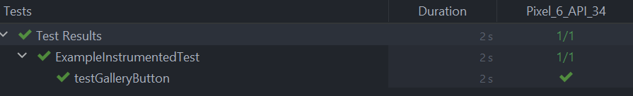
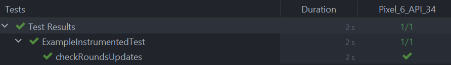
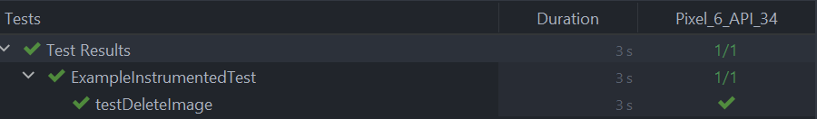

## Gallery
- Browse through a collection of default dog breeds and their corresponding images.
- Add new dog breeds by entering the breed name and uploading an image.
- Sort the Dogs alphabetically
- Delete a dog by clicking on the image
  

## Quiz
- Test your knowledge with interactive quizzes.
- View your score and the number of rounds played.
- Receive immediate feedback on the correctness of your answers.

# Test Results

## After analysing ./gradlew connectedAndroidTest –info
## I conclude that what happends in the background is:
- The main application APK being used: C:\Users\vefje\AndroidStudioProjects\Oblig1QuizApp\app\build\outputs\apk\debug\app-debug.apk
- The test APK used during testing: C:\Users\vefje\AndroidStudioProjects\Oblig1QuizApp\app\build\outputs\apk\androidTest\debug\app-debug-androidTest.apk
- The Gradle script used adb commands to install the main application APK and the test APK onto the emulator

## The following ADB commands are being used
- adb install C:\Users\vefje\AndroidStudioProjects\Oblig1QuizApp\app\build\outputs\apk\debug\app-debug.apk

- adb install C:\Users\vefje\AndroidStudioProjects\Oblig1QuizApp\app\build\outputs\apk\androidTest\debug\app-debug-androidTest.apk

## Test Gallery Button
- Tests the  gallery button in the MainActivity. Tests whether the navigation works or not. (MainActivity)

## Test Quiz Button 
- Tests the quiz button in the MainActivity. Tests whether the navigation works or not. (MainActivity)

## Test checkRoundsUpdate
- Tests if the score gets updated in the Quiz when the user presses a button. (QuizActivity)

## Test deleteImage
- Tests if the dog object you click on gets deleted from the GridView if you click on it. (GalleryActivity)

## Test testScoreUpdate
- Tests whether the score updates when clicking an answer. (QuizActivity)
